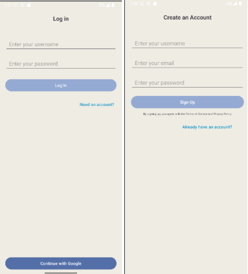
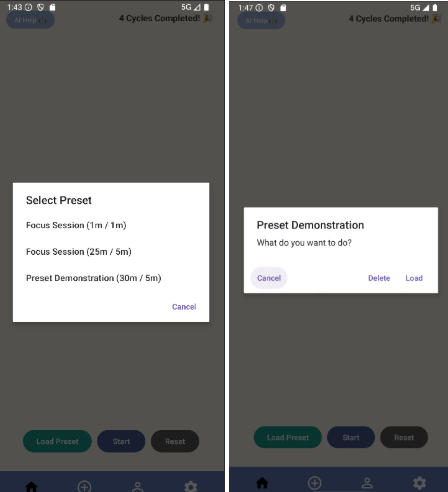
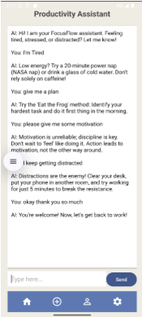
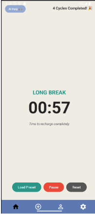
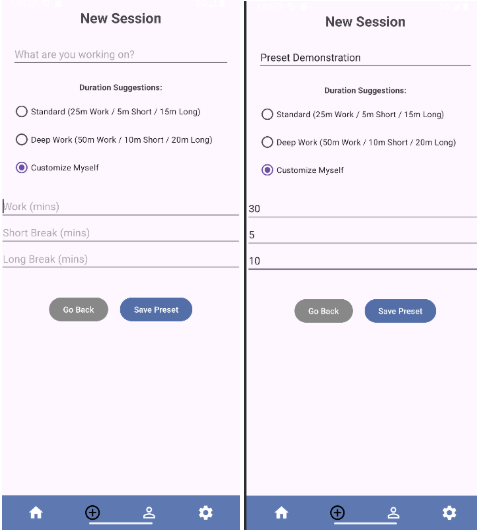
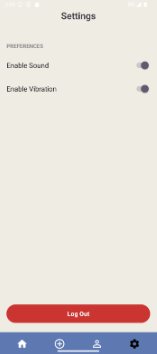
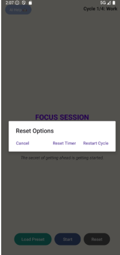
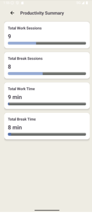

# ProductivityAssistant

Android prototype for a multi-user Pomodoro timer with customizable focus cycles and on-device data persistence.

> ⚠️ This project is a **functional prototype** built for academic and learning purposes.  
> It focuses on demonstrating core Pomodoro timer logic and local user session handling rather than production-ready features.

## Project Overview

ProductivityAssistant is an Android application prototype designed to help students improve focus and time management using the Pomodoro technique.

The app allows users to:
- Create local user profiles on a single device
- Run Pomodoro-based focus sessions with configurable work and break cycles
- Track session progress and productivity summaries

## Core Concept

The application is built around a customizable Pomodoro workflow.  
Users can define their own focus cycles (work duration, short breaks, long breaks, and repetition count) instead of being limited to a fixed Pomodoro preset.

## Features

### User & Session Handling
- ✔ Local user profile creation and login (single-device prototype)
- ✔ Session persistence per user on the same device
- ✖ Cross-device accounts or cloud synchronization

### Pomodoro Timer
- ✔ Pomodoro-based countdown timer
- ✔ Automatic transitions between work, short break, and long break
- ✔ Customizable cycle configuration (durations and repetitions)
- ✔ Timer reset and session restart

### Productivity Tracking
- ✔ Session completion tracking
- ✔ Basic productivity summary per user

### General
- ◐ Minimal error handling
- ✔ All core screens fully wired and functional

## Screenshots

### User Setup

| Sign Up | Load Preset |
|--------|-------------|
|  |  |

---

### Timer Flow

| Focus Session | Short Break | Long Break |
|---------------|-------------|------------|
|  |  |  |

---

### Customization & Control

| Add Session | Settings | Reset |
|-------------|----------|-------|
|  |  |  |

---

### Summary

| Productivity Summary |
|----------------------|
|  |

